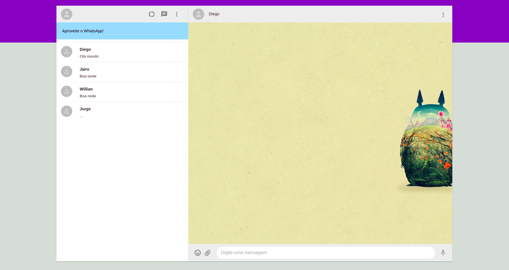

# WhatsApp-Web-Interface-React
   A similar interface of whatsapp web :godmode:

## Contributing 

### Follow these steps:

- Fork this repository on Github.
- Clone the forked repository:
  - `git clone https://github.com/Jairotsb/WhatsApp-Web-Interface-React.git`
- Install dependencies: 
  - `npm install`
  - `npm install -g react` **no react dependencie**
- Execute project: 
  - `npm start`
- Create another branch and enter it:
  - `git branch new-branch`
  - `git switch new-branch`
- Make the changes and then:
  - `git add .`
  - `git commit -m "new improviments added :godmode: "`
  - `git push -u origin new-branch`
- Open a Pull Request on Github.

## Technologies used :memo:

 - Framework: Material-UI :white_check_mark:
 - Front-end: ReactJs :white_check_mark:

    
  
  
  
  
  
  
  
   
